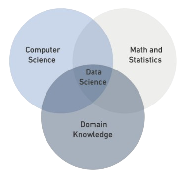

# Data Science
## What is Data Science?
**Data Science** is a *multidisciplinary field* that combines statistics, computer science, and domain knowledge.

### Data Types:
- Structure
- Semi-Structure
- Unstructured

| **Structured**           | **Semi-Structured**                            | **Unstructured**           |
|---------------------------|-----------------------------------------------|-----------------------------|
| Organized into a schema.  | No schema but has some structure.             | No schema.                 |
| e.g., Tables              | e.g., XML                                     | e.g., Photos               |

<pre style="background-color: transparent; color: black;">
print("DS Bootcamp")
</pre>

<a href="https://en.wikipedia.org/wiki/Data_science" style="font-weight: bold; color: blue;">Read more</a>

